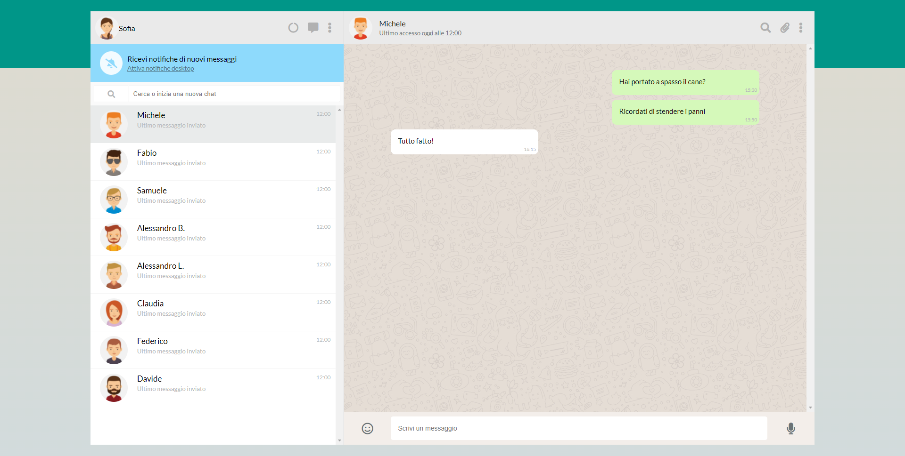

# Boolzapp

### Descrizione

Questa repository presenta un clone di WhatsApp Web sviluppato utilizzando i linguaggi HTML, CSS, JavaScript e VueJs.

Le diverse funzionalità verranno implementate progressivamente attraverso varie fasi. La repository è organizzata in cartelle, ciascuna corrispondente a una milestone specifica in cui viene implementata una parte del clone.

### Layout di riferimento

## Risoluzione in linguaggio naturale

### Milestone 1

In questa milestone verrà replicata la grafica di riferimento con la possibilità di avere messaggi scritti dall’utente (verdi) e dall’interlocutore (bianco). La visualizzazione della lista dei contatti sarà implementata in modo dinamico

1. Creare la struttura html e css
2. Creare 2 classi css:
   - Una per i messaggi inviati dall'utente (sfondo verde e allinemaento a destra)
   - Una per i messaggi inviati dall'interlocutore (sfondo bianco e allineamento a sinistra)
3. Tramite la direttiva v-for visualizzare in modo dinamico lista dei contatti

### Milestone 2

Le 2 funzionalità che verranno impementate in questa milestone sono:
**visualizzazione dinamica messaggi** (visualizzare tutti i messaggi relativi al contatto attivo all’interno del pannello della conversazione)
**click su contatto** (mostra la conversazione del contatto cliccato).

1. Nel v-for dei contatti passare anche index

   > v-for="(contact, index) in contacts"

2. Interpolare le variabili

3. Condizione per applicare classi ai messaggi inviati (utente o interlocutore)

4. Creare nei data una varibile (contatto attivo) con il valore default 0

5. Al click eseguire una funzione che passa a contatto attivo l'index corrente

### Milestone 3

Le 2 funzionalità che verranno impementate in questa milestone sono: aggiunta di un nuovo messaggio tramite tasto enter, risposta interlocutore (ok, dopo un secondo)

1. Direttiva v-model sull'input

2. Al @keyup.enter aggiungere due nuovi oggetti all'array:

   - Proprietà: date-"00:00", message-"testo input", status"sent".
   - Proprietà: date-"00:00", message-"ok", status"received".

3. Creare una timing function per visualzzare la risposta "ok" dopo un secondo

### Milestone 4

In questa milestone verrà implementato il codice per cercare e filtrare i contatti.

1. V-model sull'input per la ricerca

2. Funzione per cercare i contatti, verficare se il testo in input è incluso nei nomi all'interno dell'array

3. Sostituire nel v-for l'array dei contatti con il nuovo array filtrato

### Milestone 5

Nella milestone 5 sono state introdotte 2 funzionalità per migliorare l'esperienza utente:

1. Ora è possibile cancellare un messaggio selezionato facendo clic su di esso, il che attiverà un menu a tendina

2. Nella lista dei contatti, è stata aggiunta la visualizzazione dell'ora e dell'ultimo messaggio inviato/ricevuto

### Bonus

Nella sezione bonus, ho implementato alcune funzionalità aggiuntive per arricchire ulteriormente l'applicazione:

1. La disabilitazione dell'invio di un messaggio se è vuoto o composto solo da spazi
2. Durante la digitazione di un messaggio, verrà visualizzato un aeroplano di carta al posto del microfono. Facendo clic sull'aeroplano, il messaggio verrà inviato
3. Facendo clic sui tre puntini in alto, si aprirà un popup che consente di eliminare tutti i messaggi di una chat o addirittura eliminare l'intera chat
4. È stata aggiunta la funzione di aggiunta di nuovi contatti: facendo clic su "+", verranno richiesti il nome, il cognome e un URL per un'immagine, che saranno utilizzati per creare un nuovo contatto
